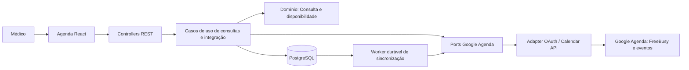

# TechSpec — Integração com Google Agenda

**Estado:** proposta técnica para revisão do gate `create_techspec`

**Data:** 2026-10-01

## 1. Resumo executivo

A feature estende a agenda já existente no PsiqApp e integra o calendário principal da conta Google conectada pelo médico. O PsiqApp continua sendo a fonte de verdade para a consulta, sua data/hora e seu status. A integração consulta apenas intervalos ocupados para bloquear horários; eventos Google existentes não são importados nem exibidos como consultas.

A implementação adiciona OAuth no backend, consulta de disponibilidade antes e durante a criação da consulta, persistência durável das operações de sincronização e um processador de novas tentativas. A falha ao gravar no Google não desfaz consulta ou status já salvos no PsiqApp. A falha ao verificar disponibilidade em uma conexão ativa impede a criação de uma nova consulta, como exige o PRD.

A página `/agenda` será modificada: terá um painel de estado/conexão Google, informação de sincronização em cada consulta e um passo explícito de verificação de disponibilidade no formulário de nova consulta. A página mantém a lista e os filtros atuais; não se propõe uma grade mensal nem a definição de horário comercial, que não estão especificados no PRD.

## 2. Requisitos de origem

| Requisito | Cobertura técnica |
|---|---|
| RF-001 | TS-001, TS-002, TS-005, TS-006 |
| RF-002 | TS-001, TS-002, TS-003, TS-005 |
| RF-003 | TS-001, TS-003, TS-004, TS-005 |
| RF-004 | TS-001, TS-003, TS-004, TS-005 |
| RF-005 | TS-001, TS-003 |
| RF-006 | TS-001, TS-003, TS-005 |
| RNF-001 | TS-002, TS-004, TS-006 |
| RNF-002 | TS-003, TS-004, TS-006 |
| RNF-003 | TS-001, TS-005 |

## 3. Arquitetura e fluxo de dados

O backend continua em Spring Boot 3.5.16 / Java 21, com arquitetura hexagonal pragmática e PostgreSQL. O frontend continua na feature `apps/frontend/src/features/consultas`, em React 19/Vite. A integração Google fica restrita a adapters externos; domínio e casos de uso dependem de ports da aplicação, não do SDK Google.



Fluxos:

1. **Conexão:** a página abre uma rota de autorização do backend. O backend redireciona ao Google, valida o `state` recebido no callback contra o estado de curta duração associado à sessão do navegador, troca o código por credenciais e persiste o refresh token cifrado. O callback volta para `/agenda` com um resultado opaco; nenhum código ou token é entregue à SPA.
2. **Verificação de horário:** a página envia a data/hora candidata à API. O caso de uso verifica sobreposição com consultas `AGENDADA` locais. Com conexão Google ativa, consulta também `freeBusy.query` para o intervalo de uma hora. Só devolve disponível quando as duas fontes foram verificadas e não há sobreposição. Sem conexão por escolha do médico, verifica apenas o PsiqApp.
3. **Criação:** no `POST` existente de consulta, o backend repete as verificações. Se a conexão ativa não puder responder, a API não persiste uma nova consulta. Se houver conflito, responde como conflito. Se estiver livre, uma única transação salva a consulta, a idempotência e a intenção de sincronização. A chamada de criação/atualização do evento ocorre depois do commit.
4. **Mudança de status:** o caso de uso atualiza o status e marca a sincronização como pendente na mesma transação. O worker lê o status atual da consulta e reconcilia o evento Google fora da transação.
5. **Desconexão:** o backend encerra a conexão e apaga o refresh token local. Tenta revogar a autorização no Google fora da transação; falha nessa revogação não reativa a conexão local nem remove eventos já criados. Pendências permanecem aguardando uma nova conexão.

O horário é verificado novamente no momento do `POST`, pois a confirmação exibida na interface pode ficar desatualizada. A checagem e gravação local usam um lock transacional PostgreSQL para serializar criação de consultas no MVP de médico único. Não há transação distribuída entre PostgreSQL e Google: uma alteração concorrente feita diretamente no Google após o `freeBusy` ainda pode criar uma corrida externa; a verificação mais próxima da persistência reduz essa janela, mas não a elimina.

## 4. Componentes

### TS-001 — Experiência da Agenda

**Responsabilidade:** estender a página de agenda existente para conexão, consulta de disponibilidade e estado da sincronização, sem criar uma segunda agenda ou exibir compromissos importados.

**Requisitos relacionados:** RF-001 a RF-006, RNF-003.

**Decisão de UX:** manter título, filtros, lista paginada e formulário atuais. Inserir um painel de conexão logo abaixo do cabeçalho; mostrar o estado Google em texto e a ação disponível. Cada consulta da lista recebe um estado de sincronização. No formulário, a data/hora inserida é uma candidata até a ação **Verificar disponibilidade** concluir; qualquer alteração posterior nessa data/hora invalida o resultado e desabilita **Criar consulta** até nova verificação.

```text
Agenda                                         N consultas
[Google Agenda: Conectada | Desconectada | Indisponível] [ação compatível]

Consultas
[filtros atuais]
[consulta: paciente / data / hora / status local / estado Google]

Nova consulta
Paciente
Data e hora                              [Verificar disponibilidade]
[mensagem específica de estado ou erro recuperável]
Observações
[Criar consulta]
```

Estados obrigatórios da interface:

- `NAO_CONFIGURADA`: informar que a conexão não está disponível neste ambiente; manter agendamento local e não oferecer um botão que inicie um fluxo impossível.
- `NAO_CONECTADA` e `DESCONECTADA`: informar que o agendamento local continua disponível; a ação conecta/reconecta. Consultas pendentes mostram que aguardam conexão.
- `CONECTADA`: oferecer desconexão; confirmar antes da ação e explicar que os eventos já criados permanecerão no Google sem novas atualizações pelo PsiqApp.
- `INDISPONIVEL`: informar que não foi possível consultar o Google, oferecer reconexão/tentativa compatível e bloquear novos agendamentos até nova verificação.
- Disponibilidade `VERIFICANDO`, `DISPONIVEL`, `OCUPADO` e `NAO_VERIFICADA`: usar mensagem junto ao campo e anunciar mudanças sem mover o foco. `OCUPADO` impede concluir o agendamento. Uma indisponibilidade do Google é um estado de integração, nunca uma mensagem de conflito.
- Sincronização por consulta: `SINCRONIZADA`, `AGUARDANDO_CONEXAO`, `PENDENTE`, `FALHA` ou `NAO_APLICAVEL` para consulta anterior à feature que não tenha evento correspondente. `PENDENTE/FALHA` oferece **Tentar sincronizar novamente** quando aplicável; `NAO_APLICAVEL` aparece como “Sem evento Google associado”.

Antes da autorização, a página explica em linguagem simples que cada evento enviado contém nome, e-mail e horário do paciente, não o conteúdo clínico, e que a visibilidade segue o compartilhamento configurado no Google Agenda. Um evento Google ocupado é representado apenas como horário indisponível. A interface não mostra título, participantes, descrição ou outro detalhe do evento. Os estados usam texto/ícone além de cor e mantêm contraste legível; campos têm rótulos visíveis e erros próximos associados por `aria-describedby`. Em falhas de validação com vários campos, apresentar resumo focável com links para os campos e manter os erros locais. Durante chamadas assíncronas, a região informa estado ocupado (`aria-busy`) sem piscar ou mover o foco. A experiência deve funcionar por teclado, ter foco visível, manter alvos de toque de pelo menos 44px com espaçamento adequado e reorganizar os controles em uma coluna em telas estreitas. Preservar tokens, tipografia e hierarquia visuais usados pelo frontend atual; qualquer movimento respeita `prefers-reduced-motion`.

**Limite da proposta:** o PRD não define horário de funcionamento nem intervalos oferecidos pelo consultório. A página mantém a entrada de data/hora que já existe e valida a candidata; não inventa expediente, grade de slots ou granularidade de minutos.

### TS-002 — Conexão OAuth e port de autorização

**Responsabilidade:** iniciar e concluir a autorização Google no backend, persistir a conexão e fornecer credenciais renováveis ao adapter Calendar.

**Requisitos relacionados:** RF-001, RNF-001, RNF-002.

Usar OAuth 2.0 de servidor com fluxo de código de autorização e Google API Java Client (OAuth e Calendar API v3) isolado em adapter; fixar versões das dependências no `pom.xml` durante a implementação. Solicitar apenas `https://www.googleapis.com/auth/calendar.freebusy` e `https://www.googleapis.com/auth/calendar.events.owned`: leitura de disponibilidade e gestão de eventos nos calendários pertencentes à conta. Configurar acesso `offline` para sincronização sem a presença do médico; ao iniciar uma conexão sem refresh token local, pedir consentimento para obter um novo refresh token. Usar `state` aleatório, imprevisível, de uso único e vinculado à sessão que iniciou a conexão. O cookie da sessão OAuth deve ser `HttpOnly`, `SameSite=Lax` e `Secure` fora do loopback local. O callback e o destino final são URLs fixas/configuradas; não aceitar URL de retorno arbitrária. O frontend nunca recebe client secret, access token ou refresh token.

O port de autorização é consumido somente pelo caso de uso de conexão; o port de calendário do TS-003 cobre disponibilidade e eventos. Não adicionar autenticação global de usuários nem transformar a autorização Google em login do PsiqApp.

### TS-003 — Disponibilidade, consulta e sincronização

**Responsabilidade:** coordenar as regras de disponibilidade local/Google e produzir a intenção de sincronizar evento após criação ou mudança de status.

**Requisitos relacionados:** RF-002, RF-003, RF-004, RF-005, RF-006.

- Uma consulta ocupa `[agendadaPara, agendadaPara + 1 hora)`. Comparar intervalos em instantes, com início inclusivo e fim exclusivo; converter apenas na borda da interface/API. A verificação Google usa o calendário `primary`, `timeZone=America/Sao_Paulo` e retorna somente intervalos ocupados.
- Revalidar no caso de uso de criação. Se uma conexão ativa falhar ou tiver sido revogada, não salvar a consulta; distinguir isso de conflito conhecido. Sem conexão por escolha do médico, aplicar somente a verificação local.
- A criação da consulta e a criação do registro de sincronização são atômicas no PostgreSQL. O evento Google é enviado depois do commit; a falha externa não altera a resposta de sucesso local nem desfaz a consulta.
- Atualizações de status `REALIZADA` e `FALTA` de uma consulta gerenciada pela feature mantêm o evento e atualizam sua identificação de status por atualização parcial, preservando início/fim. Para `CANCELADA`, a decisão técnica é remover o evento Google; o estado local da consulta permanece `CANCELADA`. Essa opção é permitida pelo RF-004 e satisfaz AC-RF004-02. Consulta legada sem evento permanece local e recebe estado `NAO_APLICAVEL`.
- A sincronização reconcilia o estado atual da consulta, não uma sequência antiga de alterações. Se a consulta for cancelada antes de um evento ser criado, não criar evento; se um evento já existir, removê-lo. Depois de uma desconexão voluntária, executar as pendências apenas após nova autorização.

### TS-004 — Persistência e worker durável

**Responsabilidade:** guardar a autorização sem texto puro e registrar operações Google pendentes/finalizadas de modo recuperável após restart.

**Requisitos relacionados:** RF-001, RF-003, RF-004, RNF-001, RNF-002.

Adicionar migration Flyway para:

- `conexao_google_agenda`: registro único da conta do médico, estado, refresh token cifrado e metadados mínimos de atualização;
- `sincronizacao_consulta_google`: uma linha por `consulta`, FK restritiva, ID de evento, estado de sincronização, tentativas, próxima tentativa e categoria sanitizada do último erro.

Estados da conexão: `NAO_CONECTADA`, `CONECTADA`, `DESCONECTADA` e `INDISPONIVEL`; estado `NAO_CONFIGURADA` pode ser calculado quando credenciais OAuth não existem no ambiente. Estados de sincronização: `AGUARDANDO_CONEXAO`, `PENDENTE`, `SINCRONIZADA` e `FALHA`. A conexão e o status de cada evento são informações distintas.

Cifrar o refresh token com AES-256-GCM, IV aleatório por gravação e chave fornecida fora do repositório por variável de ambiente/secret. Não persistir access token; obtê-lo/renová-lo em memória. Se a chave de cifragem ou credenciais do cliente estiverem ausentes, a aplicação continua iniciando e o endpoint de estado indica integração não configurada; o endpoint de conexão não inicia o fluxo.

Não fazer backfill de consultas existentes na migration: isso evitará criar eventos no Google para histórico sem ação explícita do médico. A sincronização passa a acompanhar consultas criadas após a ativação da feature; consultas legadas sem evento correspondente continuam visíveis e recebem `NAO_APLICAVEL`. Também não sincronizar alteração de status de uma consulta legada sem registro/evento Google.

Criar worker no mesmo processo Spring Boot, com consulta paginada/claim transacional das linhas vencidas, sem chamada externa dentro da transação. A persistência torna as tentativas recuperáveis após restart; não adicionar broker externo. Aplicar retry exponencial limitado a cinco tentativas automáticas para falhas transitórias; então marcar `FALHA` e permitir nova tentativa manual. Erro permanente de autorização marca a conexão `INDISPONIVEL` e requer ação do médico.

### TS-005 — API HTTP e contratos da agenda

**Responsabilidade:** expor estados seguros à SPA e preservar os endpoints existentes de consulta/status.

**Requisitos relacionados:** RF-001 a RF-006, RNF-003.

As rotas são propostas dentro da base REST/JSON `/api/v1` já usada pelo backend:

| Método e rota | Contrato proposto |
|---|---|
| `GET /integracoes/google-agenda` | Estado da conexão e contagem opcional de pendências; nunca retorna credenciais ou detalhes de eventos. |
| `GET /integracoes/google-agenda/conectar` | Inicia navegação OAuth e responde com redirect para Google. Usar navegação de página, não `fetch`. |
| `GET /integracoes/google-agenda/callback` | Callback server-side; conclui autorização e redireciona para `/agenda` com resultado opaco. |
| `DELETE /integracoes/google-agenda/conexao` | Desconecta localmente, tenta revogação remota e preserva eventos/pedidos pendentes. |
| `GET /consultas/disponibilidade?agendadaPara={ISO-8601}` | Retorna apenas `DISPONIVEL`, `OCUPADO` ou `INDISPONIVEL`; duração fixa de uma hora. Não retorna intervalos ou detalhes Google. |
| `POST /pacientes/{pacienteId}/consultas` | Mantém contrato e `Idempotency-Key`; revalida disponibilidade, persiste consulta + intenção de sincronização e retorna estado Google da consulta. |
| `POST /consultas/{id}/status` | Mantém transição atual; retorna novo status local e estado de sincronização pendente/concluído ou `NAO_APLICAVEL` para consulta legada. |
| `POST /consultas/{id}/sincronizacao-google/tentar-novamente` | Marca operação para execução imediata e retorna `202` com estado pendente. |

Adicionar ao `ConsultaResponse` um objeto não sensível de sincronização Google (estado e, se útil, instante da última tentativa). Para incompatibilidade com a resposta atual, considerar o campo aditivo e opcional. Consultas anteriores à feature sem vínculo devolvem estado `NAO_APLICAVEL`. Usar Problem Details existente: `409` para horário ocupado; `503` com código estável, por exemplo `GOOGLE_DISPONIBILIDADE_INDISPONIVEL`, para falha de verificação Google; não incluir corpo, mensagem ou código bruto do provider.

### TS-006 — Configuração, privacidade e telemetria

**Responsabilidade:** carregar segredo/configuração do OAuth e da cifra, proteger dados do médico/paciente e registrar somente eventos operacionais.

**Requisitos relacionados:** RNF-001, RNF-002, RNF-003.

Configurar client ID, client secret, redirect URI, URI de retorno frontend permitida e chave de cifra por ambiente, seguindo o prefixo `PSIQAPP_` usado pelo backend. `.env.example` conterá somente placeholders quando a task de implementação documentar a configuração. Tokens, códigos OAuth, `state`, nomes/e-mails de pacientes e conteúdo de eventos não entram em logs. Logs registram operação, estado, duração, número de tentativas, request ID e categoria/código HTTP sanitizado. Mensagens de erro à interface não reproduzem resposta Google.

## 5. Interfaces e contratos

### Port de disponibilidade e eventos

O contrato de aplicação deve expressar somente dados do caso de uso, sem tipos do SDK Google:

- `consultarOcupacao(inicio, fim) -> intervalosOcupados`;
- `criarEvento(evento)`;
- `atualizarEvento(idEvento, evento)`;
- `removerEvento(idEvento)`.

O evento de saída contém nome/e-mail do paciente e início/fim; não contém CPF, observações ou conteúdo do prontuário. O port de autorização cobre gerar URL, trocar código, renovar credencial e revogar autorização. Adapters e DTOs convertem os contratos para API Google.

### Payload de evento

- `calendarId=primary`;
- título com nome completo do paciente e identificação do status final quando `REALIZADA` ou `FALTA`;
- e-mail do paciente no evento, sem registrá-lo como participante/convite;
- `start` e `end` RFC3339 com `America/Sao_Paulo`, diferença de uma hora;
- evento bloqueia horário (`transparency=opaque`) e usa visibilidade privada;
- sem CPF, observações, diagnóstico, medicação ou conteúdo clínico.

Para idempotência externa, definir `event.id` como UUID da consulta sem hífens, em minúsculas (caracteres compatíveis com base32hex). Guardar também o UUID da consulta em `extendedProperties.private`; em resposta ambígua de criação, buscar o evento por ID e conferir essa propriedade antes de reconciliar. UUID é identificador de baixa probabilidade de colisão; uma colisão/mismatch não pode autorizar atualizar ou remover evento alheio.

## 6. Modelo de dados e persistência

| Estrutura | Campos/garantias principais | Responsabilidade |
|---|---|---|
| `conexao_google_agenda` | singleton; estado; refresh token cifrado; timestamps; última categoria de erro | Uma conexão voluntária do médico com OAuth Google. |
| `sincronizacao_consulta_google` | `consulta_id` PK/FK restritiva; `google_event_id`; estado; tentativas; próxima tentativa; timestamps; categoria de erro | Estado durável e recuperável para evento correspondente à consulta. |
| `consulta` atual | UUID, `paciente_id`, `agendada_para`, status e observações | Continua sendo a fonte de verdade do produto; adicionar nova restrição local de sobreposição de forma concorrente-segura. |

Não armazenar cópia de eventos Google, intervalos de disponibilidade ou detalhes de eventos existentes. Os dados de pacientes já existentes em `patient` só são lidos para montar o evento necessário. Migration deve incluir índices para buscar sincronizações vencidas e verificar sobreposição com consultas `AGENDADA`; não inserir registros de sincronização para consultas legadas.

O `CriarConsultaUseCase` atual valida paciente/idempotência e persiste em transação, mas não verifica conflitos. A implementação deve acrescentar a checagem local na criação. Dentro da transação, adquirir um `pg_advisory_xact_lock` com chave constante dedicada à agenda, consultar sobreposição com consultas `AGENDADA` e só então persistir; o lock é liberado automaticamente ao encerrar a transação. Isso serializa os writers atuais sem constraint que possa falhar por sobreposição histórica já existente. Nenhum request externo deve manter a transação aberta. A escolha usa lock transacional para o recurso de agenda do médico único, conforme [documentação PostgreSQL de advisory locks](https://www.postgresql.org/docs/current/functions-admin.html#FUNCTIONS-ADVISORY-LOCKS).

## 7. APIs / entradas e saídas

As propostas do TS-005 respeitam as rotas e o estilo DTO atual. `agendadaPara` continua como instante ISO 8601 com offset e resposta em UTC. A interface exibe horário em `America/Sao_Paulo`, conforme política da seção 12 de `docs/TECHNICAL.md`.

Contrato de disponibilidade:

```json
{
  "estado": "DISPONIVEL",
  "fusoHorario": "America/Sao_Paulo",
  "verificadoEm": "2026-10-01T12:00:00Z"
}
```

`OCUPADO` não identifica se o intervalo veio de consulta local ou Google. `INDISPONIVEL` é reservado para falha ao consultar Google durante conexão ativa e nunca significa horário ocupado. Se a conta não foi conectada ou foi desconectada voluntariamente, a resposta é calculada com as consultas locais e a UI informa essa condição.

## 8. Integrações externas

- **OAuth:** autorização server-side de código, `state` validado, acesso offline e renovação por refresh token. Documentação oficial: [OAuth 2.0 para aplicações web server](https://developers.google.com/identity/protocols/oauth2/web-server), [Google API Client para Java](https://developers.google.com/api-client-library/java/google-api-java-client/oauth2) e [boas práticas OAuth](https://developers.google.com/identity/protocols/oauth2/resources/best-practices).
- **Disponibilidade:** `freeBusy.query` com o período candidato e somente `primary`; consumir apenas intervalos de `busy`. A API documenta intervalos com início inclusivo/fim exclusivo e escopos `calendar.freebusy`/`calendar.events.freebusy`: [referência FreeBusy](https://developers.google.com/workspace/calendar/api/v3/reference/freebusy/query).
- **Eventos:** criar/atualizar em `primary`; usar atualização parcial somente dos campos de identificação/status, preservando início/fim; remover quando a consulta for cancelada. Google permite definir ID de evento na criação e restringe seus caracteres a base32hex, o que permite usar UUID sem hífens como chave estável: [recurso Event](https://developers.google.com/workspace/calendar/api/v3/reference/events), [inserção de eventos](https://developers.google.com/workspace/calendar/api/v3/reference/events/insert), [escopos Calendar](https://developers.google.com/workspace/calendar/api/auth).
- **Desconexão:** revogar refresh token via endpoint OAuth de revogação. Como a revogação invalida os escopos concedidos, executar somente na ação explícita do médico; apagar o token local e preservar os eventos permanece o resultado mesmo se a chamada externa falhar: [revogação de tokens](https://developers.google.com/identity/protocols/oauth2/web-server#tokenrevoke).

A integração não usa notificações/push, importação de eventos, seleção de calendários, convidados ou sincronização bidirecional nesta etapa.

## 9. Tratamento de erros e resiliência

| Cenário | Comportamento de backend | Comportamento de UI |
|---|---|---|
| Google ocupado | `OCUPADO`; nenhuma consulta criada | Mensagem de horário indisponível junto à data/hora; permitir correção e nova verificação. |
| Google inacessível/revogação inesperada durante `freeBusy` | Marcar conexão `INDISPONIVEL`; não criar nova consulta; erro Problem Details sanitizado | Mensagem específica de falha de verificação; bloquear criação e oferecer reconexão/tentativa. |
| Conta ausente/desconectada voluntariamente | Verificar apenas PsiqApp; sincronizações permanecem `AGUARDANDO_CONEXAO` | Agenda local continua funcionando; explicar escopo da verificação e oferecer conexão. |
| Erro ao criar/atualizar/remover evento após persistência local | Consulta/status permanece; manter sincronização pendente/falha | Mostrar estado por consulta e ação de nova tentativa. |
| Timeout após Google processar `insert` | Consultar ID determinístico e validar propriedade privada; reconciliar sem duplicar | Estado fica pendente até confirmação. |
| Evento já removido no Google | Para operação de remoção, tratar `404` como resultado convergente | Marcar sincronização concluída. |
| Falha OAuth/token | Não expor código/resposta; classificar causa e marcar conexão indisponível quando exigir nova autorização | Ação de reconectar; erro não é mostrado como conflito. |

As chamadas externas têm timeout finito e configurável. Retry automático aplica-se a falhas transitórias; erros permanentes não geram loop. Repetições manuais são idempotentes. Toda sincronização pode ser reexecutada após restart lendo seu estado persistido.

## 10. Segurança, privacidade e compliance

- MVP permanece limitado a dados fictícios. Conectar uma conta Google não autoriza enviar dados reais de pacientes.
- Nome, e-mail e horário do evento podem revelar atendimento psiquiátrico; tratá-los com proteção compatível com dado sensível. O evento usa somente os campos explicitados no PRD. Não enviar CPF, observações ou qualquer conteúdo clínico.
- Escopos limitados a disponibilidade e gestão de eventos nos calendários do médico. FreeBusy não armazena nem apresenta detalhes do compromisso que causou a ocupação.
- Cifrar refresh token; manter client secret e chave de cifra fora do Git; não retornar nem logar token, código OAuth, estado OAuth ou payload de evento.
- Validar `state` no callback, limitar redirect URI, usar HTTPS fora do loopback local e impedir destinos de redirect controlados por query string. Respostas do callback não devem ser armazenadas em cache; query com código não deve entrar em logs.
- A aplicação atual não tem autenticação/autorizações de usuário. Esta feature não muda esse limite nem pode ser exposta como serviço multiusuário. Uso com dados reais segue bloqueado pelas Rules até decisão e salvaguardas listadas em `clinical-data-privacy.md`.
- Consentimento/verificação do app Google, base legal, transparência ao titular e condições de fornecedor precisam estar definidos antes de qualquer uso real, conforme o PRD e a Rule de privacidade.

## 11. Observabilidade

Emitir métricas/logs de contagem por operação e estado (`freebusy`, `insert`, `update`, `delete`, OAuth), duração, tentativa, sucesso/falha e categoria sanitizada do erro. Usar request ID existente. IDs técnicos podem auxiliar correlação; nunca registrar nome, e-mail, intervalo com vínculo a paciente, descrição de evento, tokens, `code` ou `state`. Não criar dashboard/serviço de observabilidade novo nesta feature.

## 12. Estratégia de testes

Todos os testes externos usam fakes/mocks; nenhuma suite depende de Google real ou de rede. Não usar dados reais de pacientes.

### Unitários

- cálculo de sobreposição para instantes, fim exclusivo e duração fixa de uma hora;
- estados de conexão e sincronização, incluindo desconexão voluntária versus falha inesperada;
- payload de evento para `AGENDADA`, `REALIZADA`, `FALTA` e `CANCELADA`; assegurar ausência de CPF, observações e conteúdo clínico;
- política para timeout, `401`/revogação, erro transitório, evento já existente e evento ausente ao remover;
- cifra/decifra AES-GCM e recusa de configuração inválida.

### Integração

- migration, FK/índices/claim de pendências no PostgreSQL via Testcontainers;
- migration não cria evento nem estado de sincronização para consultas legadas; a API apresenta `NAO_APLICAVEL` para elas;
- conflito local impede persistência e duas criações locais concorrentes não ocupam o mesmo intervalo;
- consulta/status e registro de sincronização persistem atomicamente; falha do adapter Google não desfaz estado local;
- criação repetida com a mesma `Idempotency-Key` e retry de worker não duplicam evento;
- restart/reprocessamento de item pendente e sincronização do status mais atual;
- rotas OAuth, `state` incorreto/reutilizado, tokens cifrados e ausência de segredo/token em resposta/log.

### E2E / fluxos de sistema

- conexão/disconexão e mensagem sobre eventos que permanecem no Google;
- cenário sem conexão e agenda local funcional;
- conflito local, conflito Google e falha de disponibilidade Google com textos/ações distintos;
- salvar consulta com integração conectada, visualizar pendência e depois sincronização concluída;
- sincronizar `REALIZADA`/`FALTA` e remover evento `CANCELADA`;
- verificar teclado, foco, leitor de tela/status live, zoom/text reflow e breakpoint móvel na página Agenda.

### Contrato, segurança ou arquitetura

- adapter Google contra servidor HTTP fake para OAuth, FreeBusy e eventos, cobrindo códigos de sucesso, erro e timeout;
- confirmar no JSON/API e logs que credenciais, payloads sensíveis e detalhes de eventos não vazam;
- executar testes ArchUnit existentes para provar preservação da direção `adapter/config -> application -> domain`; não criar ferramenta arquitetural nova.

## 13. Sequenciamento recomendado

1. Modelar disponibilidade e estado de sincronização; criar migration e proteção contra sobreposição local.
2. Criar ports e adapter OAuth/Calendar, configuração opcional e proteção/cifragem dos tokens.
3. Integrar criação e mudanças de status com o registro durável; implementar worker, reconciliação, retry e idempotência externa.
4. Expor contratos HTTP e mapear Problem Details estáveis.
5. Modificar Agenda, formulário, lista e estados acessíveis conforme TS-001.
6. Completar integração/frontend/E2E, revisão de privacidade e atualização de docs operacionais e técnicas após a implementação existir.

## 14. Decisões e trade-offs

| Decisão | Motivo e trade-off |
|---|---|
| Manter a lista atual e acrescentar um painel de conexão + verificação da data/hora candidata | Reaproveita a tela `/agenda` e satisfaz estados/ocupação sem presumir expediente nem criar uma grade que sugira horários não definidos. O médico precisa acionar a verificação explicitamente. |
| Não fazer backfill de consultas anteriores à ativação | Evita exportação inesperada de nomes/e-mails para o Google ao conectar uma conta. Uma futura sincronização histórica exigiria ação explícita, escopo e comunicação próprios. |
| Revalidar disponibilidade no `POST` | Evita depender de um resultado antigo exibido na UI; ainda existe pequena janela para alteração externa concorrente no Google, pois não há transação compartilhada. |
| Persistir sincronização e processar em worker local, sem broker | Recupera pendências após restart e desacopla o sucesso local da disponibilidade Google com uma peça operacional simples para o volume atual. |
| Usar FreeBusy, não Events.list | Obtém somente intervalos ocupados; reduz acesso e evita armazenar/exibir detalhes de eventos preexistentes. |
| Remover evento quando a consulta for `CANCELADA` | É uma das opções explicitamente permitidas no RF-004; mantém o calendário sem compromisso cancelado ativo e evita preservar dados de identificação desnecessários. Eventos não são removidos ao desconectar. |
| Usar UUID da consulta como ID de evento Google estável | Permite reconciliar timeout/retry sem duplicatas; guardar propriedade privada confere a associação antes de alterar evento. |
| Usar dois ports externos (OAuth e Calendar) | São ciclos de vida diferentes e testáveis por contratos separados; ambos ficam fora do domínio. |

## 15. Riscos técnicos e mitigação

| Risco | Mitigação |
|---|---|
| Corrida com alteração no Google depois da verificação | Revalidar imediatamente antes de salvar; comunicar em review que Google não oferece atomicidade com a gravação local. |
| Duplicata após timeout ambíguo de `insert` | ID de evento derivado de UUID, busca por ID após repetição e conferência de propriedade privada. |
| Dados pessoais expostos por compartilhamento da agenda do médico | Evento privado, acesso compartilhado sob controle do médico, texto na conexão informando os campos enviados e uso exclusivo de dados fictícios neste MVP. |
| Credencial revogada ou chave local ausente | Estado `INDISPONIVEL`/`NAO_CONFIGURADA`, bloqueio de agendamento apenas se havia conexão ativa, ação de reconexão e chave fora do repositório. |
| Evento cancelado ainda existir durante indisponibilidade | Registrar operação pendente/falha, preservar status `CANCELADA` no PsiqApp e remover ao recuperar a conexão. |
| OAuth app em status de teste | Com escopos Calendar, um OAuth consent screen em `Testing` pode emitir refresh tokens que expiram em sete dias; validar reconexão em ambiente de desenvolvimento e fluxo de republicação/verificação antes de uso persistente. Consultar [OAuth 2.0 para aplicações web server](https://developers.google.com/identity/protocols/oauth2/web-server). |
| App local não tem autenticação | Limitar uso a ambiente local e dados fictícios; não interpretar OAuth Google como autenticação do PsiqApp nem como autorização multiusuário. |

## 16. Conformidade com Rules, arquitetura e skills

| Restrição/Rule | Fonte | Módulo e responsabilidade existentes | Decisão da feature | Verificação |
|---|---|---|---|---|
| Dependências apontam para dentro e integrações ficam em adapters | `.agents/rules/architecture-boundaries.md`; `docs/TECHNICAL.md` §§3, 5 | `domain`, `application/port/out`, `application/usecase`, `adapter/in/web`, `adapter/out` | Criar casos de uso/ports para OAuth e Calendar; SDK e HTTP externo somente em `adapter/out`; controllers só convertem contrato e chamam caso de uso. | Testes ArchUnit existentes + revisão dos imports/dependências. |
| Frontend separa `features` e `shared` | `.agents/rules/architecture-boundaries.md`; `docs/TECHNICAL.md` §14 | `features/consultas` compõe Agenda/formulários/lista; `shared` contém componentes transversais | Implementar painel, estados e verificação na feature de consultas; só mover algo para `shared` se houver uso transversal real. | Typecheck, lint, testes da página Agenda e E2E. |
| OAuth e Calendar API não entram no domínio | `.agents/rules/architecture-boundaries.md` | Backend hexagonal | Portas substituíveis e adapter externo; chamadas Google fora de transação. | Fakes unitários/integração e ArchUnit. |
| Privacidade de paciente, segredo e dados fictícios | `.agents/rules/clinical-data-privacy.md`; PRD RNF-001/002 | `FormularioConsulta`, `CriarConsultaUseCase`, adapters e logs | Enviar nome/e-mail/horário apenas para eventos do PsiqApp; FreeBusy recebe período; cifrar refresh token; não logar payloads; dados fictícios até decisão para produção. | Testes de payload/cifra/logs e review de privacidade. |
| Agenda e linguagem ubíqua | `docs/BUSINESS.md` §§3, 4, 7 | `PaginaAgenda`, `FormularioConsulta`, `ListaConsultas`, `Consulta` | Preservar termos Consulta, Médico, Paciente e estados locais; eventos Google ocupados não viram consultas. | Casos AC-RF002/005 em API e E2E. |
| Instantes API em UTC e interface em `America/Sao_Paulo` | `docs/TECHNICAL.md` §§12, 14; PRD AC-RF002-06 | validação de consulta, API e exibição da Agenda | Calcular 1h como intervalo de instantes e informar timezone ao Google. | Testes de limite de intervalo e fuso. |
| Serviços externos são fakes/mocks por padrão | `.agents/rules/testing-quality.md` | Adapters externos de Google | Nenhum teste automatizado de rotina depende de rede ou conta Google real. | Contratos via servidor HTTP fake. |
| Acessibilidade e feedback observável; evitar padrão genérico | `.agents/skills/ui-ux-pro-max/SKILL.md`, `references/quick-reference.md`; `.agents/skills/frontend-design/SKILL.md` | `PaginaAgenda`, `FormularioConsulta`, `ListaConsultas` | Preservar visual do produto; feedback contextual, texto além de cor, labels, foco/teclado, erros associados, recuperação e responsividade. | Teste de interação, teclado, leitor de tela, zoom e viewport móvel. A busca da skill não encontrou orientação específica para calendário após uma consulta refinada; aplicam-se os itens genéricos de acessibilidade/formulários. |

A proposta estende módulos e fronteiras existentes, sem alterar a direção global das dependências ou criar convenção compartilhada de nomenclatura. `docs/BUSINESS.md` e `docs/TECHNICAL.md` descrevem estado implementado e não devem passar a apresentar a integração como disponível nesta etapa de TechSpec. A task de implementação deve atualizar a documentação humana e o `.env.example` somente depois de confirmar o comportamento no código.

## 17. Arquivos/módulos impactados

**Backend — planejados:**

- `apps/backend/pom.xml` — dependências OAuth/Google Calendar, com versões fixadas na implementação;
- `apps/backend/src/main/java/com/psiqapp/domain/modelo/` — regra de disponibilidade/estado se exigir novo conceito de domínio;
- `apps/backend/src/main/java/com/psiqapp/application/port/out/` e `application/usecase/` — ports e casos de uso da conexão, disponibilidade e sincronização;
- `apps/backend/src/main/java/com/psiqapp/adapter/in/web/` — endpoints e DTOs;
- `apps/backend/src/main/java/com/psiqapp/adapter/out/` — adapter Google, persistência e worker de sincronização;
- `apps/backend/src/main/java/com/psiqapp/config/` — registro opcional dos componentes e propriedades;
- `apps/backend/src/main/resources/db/migration/` — conexão, sincronização e proteção contra sobreposição;
- testes unitários, de integração/PostgreSQL, arquitetura e contrato Google fake.

**Frontend — planejados:**

- `apps/frontend/src/features/consultas/PaginaAgenda.tsx` — estado da integração e coordenação da verificação;
- `apps/frontend/src/features/consultas/FormularioConsulta.tsx` — verificar/invalidate disponibilidade e bloquear envio;
- `apps/frontend/src/features/consultas/ListaConsultas.tsx` — estado e tentativa de sincronização por consulta;
- `apps/frontend/src/features/consultas/servicoConsultas.ts` ou serviço específico da feature — contratos HTTP;
- CSS existente da agenda e testes `PaginaAgenda.test.tsx`.

**Documentação a atualizar durante implementação aprovada:** `docs/TECHNICAL.md`, `docs/BUSINESS.md` se refletir novo comportamento implementado, `README.md`, `.env.example` e evidências/reviews da pasta da feature. Nenhuma implementação ou execução de testes faz parte deste artefato de TechSpec.
