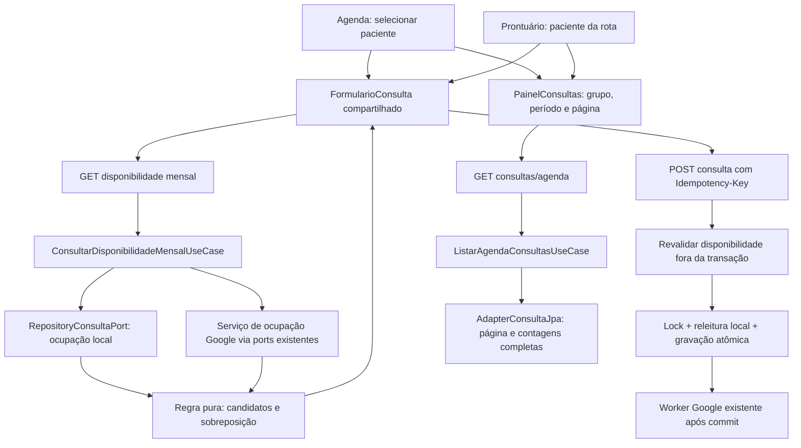

# TechSpec — Busca de horários e organização da Agenda

## 1. Resumo executivo

**Feature:** `prd-melhorias-agenda`. **Data:** 2026-10-02. **Etapa:** `create_techspec`.

**Pré-requisitos:** [prd.md](prd.md) lido integralmente; [spec-review.md](spec-review.md) com veredito **APROVADO**, A-001 resolvida e nenhum bloqueador. Este documento especifica trabalho futuro; não declara implementação, testes ou QA concluídos.

A feature adicionará a busca mensal de horários à Agenda geral e ao agendamento no prontuário, com calendário, horários agrupados e revisão da seleção. O formulário será compartilhado: na Agenda, exige paciente selecionado; no prontuário, usa o paciente da rota e omite o seletor. O caminho manual de data e hora continuará acessível, inclusive para consultas retroativas.

O backend consultará ocupação local e Google por intervalo, calculará os horários do mês e fornecerá consultas paginadas por grupo com contagens do conjunto completo. Datas inclusivas dos filtros serão resolvidas no servidor em `America/Sao_Paulo`. A confirmação reutilizará a criação idempotente, a validação Google fora da transação e o lock de agenda existentes.

**Stack confirmada:** Java 21, Spring Boot 3.5.16, Maven Wrapper, PostgreSQL 18.6, Flyway e persistência JPA/JDBC; React 19.2.8, TypeScript 6.0.3, Vite, CSS simples e `fetch`; JUnit/Mockito/ArchUnit/Testcontainers, Vitest/Testing Library e Playwright. Fontes: `apps/backend/pom.xml`, `apps/frontend/package.json`, TECHNICAL §§ 2–7, 11–12, 14–17 e README. Não são necessárias novas dependências, tabelas, migrations, infraestrutura ou credenciais.

## 2. Requisitos de origem

| Requisito | Cobertura técnica |
|---|---|
| RF-001 — Dias com horários livres | TS-001, TS-002, TS-003, TS-005, TS-009, TS-011 |
| RF-002 — Exibição e seleção | TS-001, TS-002, TS-005, TS-010 |
| RF-003 — Confirmação e paciente correto | TS-003, TS-004, TS-005, TS-009, TS-011 |
| RF-004 — Grupos, contagens e apresentação | TS-006, TS-008, TS-009, TS-010 |
| RF-005 — Período inclusivo | TS-006, TS-007, TS-008 |
| RNF-001 — Privacidade | TS-002, TS-003, TS-006, TS-009, TS-011 |
| RNF-002 — Clareza de estados | TS-002, TS-003, TS-005, TS-011 |
| Todos os RFs/RNFs e ACs | TS-012 — validação e rastreabilidade |

### Estado atual confirmado e resolução das lacunas

| Evidência inspecionada | Situação atual | Decisão |
|---|---|---|
| `PaginaAgenda.tsx`, `servicoConsultas.ts`, `ConsultaController.java`, `AdapterConsultaJpa.java` | A Agenda já tem paciente e De/Até, com páginas de 50. Envia datas simples a `de/ate` tipados como `Instant`; o SQL usa limite superior inclusivo por instante. Inspeção estática, sem reprodução executada. | Evoluir os controles existentes para um contrato novo de datas civis e incluir filtros no prontuário (TS-007). Preservar a API anterior de instantes. |
| `PaginaProntuario.tsx` e CSS | Carrega uma página de consultas junto dos dados clínicos; contagem e próxima consulta derivam dessa página. Existem formulário/lista de consultas adicionais ocultos. | Projeções completas, carregamento da Agenda independente e remoção apenas das duplicações de consultas (TS-008/009). |
| `CriarConsultaUseCase.java` e `VerificarDisponibilidadeConsultaUseCase.java` | A criação revalida disponibilidade, chama Google fora da transação, verifica conflito local sob advisory lock e grava consulta/idempotência/intenção juntas. | Reutilizar a confirmação sem nova reserva ou transação externa (TS-004). |
| `servicoConsultas.criar` versus TECHNICAL § 14 | Gera chave nova por chamada; o documento orienta conservar chave e corpo ao repetir a operação. | Corrigir essa divergência no fluxo de consultas afetado, conservando a operação no formulário (TS-004); não refatorar outras features. |
| `ClienteApi` e TECHNICAL § 14 | Mock/fallback de demonstração existe; a Agenda usa API real e o prontuário usa o padrão. | Operações de consultas desta feature usam API real nas duas origens; falha nunca vira sucesso de demonstração (TS-009/011). |
| `ArquiteturaTest.java` | Há gate de dependências internas; SDK Calendar e separação frontend `features/shared` não têm cobertura específica. | Executar ArchUnit e ampliar a lista para Google; review manual dos imports frontend (TS-012). |

As lacunas têm solução localizada nos módulos afetados. Não foi identificado conflito que exija mudar uma Rule ou a direção arquitetural registrada.

## 3. Arquitetura e fluxo de dados

Preservar `adapter/config -> application -> domain`: controllers convertem entradas/saídas; casos de uso coordenam disponibilidade/listagem; regras puras ficam no domínio; ports existentes delimitam persistência/Calendar; adapters executam SQL/SDK; config compõe os objetos.

No frontend, componentes e hooks de agenda ficam em `features/consultas`, consumidos pelas duas páginas. Reutilizar paginação, estado vazio, erros e cliente HTTP de `shared`, sem colocar lógica de consultas nesse módulo.



Disponibilidade é uma observação, não uma reserva. Filtros de paciente/período das listas nunca limitam a ocupação global do médico.

## 4. Componentes

### TS-001 — Regra temporal de disponibilidade

**Responsabilidade:** componente puro `domain/modelo/DisponibilidadeAgenda.java` para duração, passo, intervalos e cálculo de horários, usado pela busca mensal e pela verificação/criação existentes.

**Requisitos relacionados:** RF-001, RF-002, RF-003.

- Duração fixa de uma hora e passo de 30 minutos. A extração evita divergência entre busca e confirmação, sem criar um agregado persistente.
- Sobreposição: `ocupado.inicio < candidato.fim && ocupado.fim > candidato.inicio`. Intervalos adjacentes são permitidos.
- Gerar inícios civis de 00:00 a 23:30, em São Paulo, todos os dias. O último termina às 00:30 do dia seguinte; não truncar nem excluir por ultrapassar meia-noite.
- Converter início em `Instant`; fim é início mais uma hora real. Receber intervalos puros, sem tipos de SDK/JPA/ports.
- Excluir datas passadas e inícios anteriores à referência; igualdade é elegível. Receber a referência do caso de uso, sem chamar `Instant.now()`.
- Usar regras de `ZoneId`, sem offset fixo. Em transições de fuso, excluir horas civis inexistentes e representar offsets válidos de horas repetidas por instantes distintos; ordenar/deduplicar. Sem transição, existem 48 candidatos por dia antes dos filtros.

### TS-002 — Consulta mensal de disponibilidade

**Responsabilidade:** `ConsultarDisponibilidadeMensalUseCase`, entrada `YearMonth`, com rota nova em `ConsultaController`.

**Requisitos relacionados:** RF-001, RF-002, RNF-001, RNF-002.

1. Sem mês informado, usar o mês atual pelo `Clock` em São Paulo. Quando informado, validar `YYYY-MM` e rejeitar mês passado ou limites temporais não representáveis. A navegação começa hoje e não tem limite arbitrário de meses futuros.
2. Janela de ocupação: primeiro dia do mês às 00:00 até primeiro dia do mês seguinte às 00:00 **mais uma hora**, em instantes. Essa extensão cobre integralmente os últimos slots, inclusive na virada de ano.
3. Ler apenas inícios das consultas locais `AGENDADA` sobrepostas à janela, por projeção nova de `RepositoryConsultaPort`; sem paginação, paciente, cadastro ou observações.
4. Consultar Google uma vez pelo intervalo completo quando aplicável (TS-003), sem consultar candidato por candidato.
5. Depois das leituras, capturar referência do `Clock`, derivar hoje e filtrar candidatos. Assim, a latência não deixa oferecer horários que passaram durante a consulta.
6. Retornar todas as datas elegíveis do mês e seus horários livres. Dia disponível equivale a lista não vazia; datas passadas são omitidas da resposta e desabilitadas no calendário.

Por busca válida: uma leitura de ocupação local e no máximo uma consulta lógica Calendar/FreeBusy. Renovação OAuth/transporte permanecem no adapter. O cálculo é limitado a um mês, sem chamadas SQL/HTTP por slot.

### TS-003 — Ocupação Google e indisponibilidade

**Responsabilidade:** extrair `application/servico/ConsultarOcupacaoGoogleAgendaServico.java`, reutilizado pelo caso mensal e por `VerificarDisponibilidadeConsultaUseCase`.

**Requisitos relacionados:** RF-001, RF-003, RNF-001, RNF-002.

Dois consumidores reais justificam a extração de regras de conexão/credencial. Usar os ports existentes de conexão, configuração e calendário; não adicionar port. Retornar intervalos puros e indicação interna de participação Google, sem credencial no contrato HTTP.

| Estado/contexto | Comportamento |
|---|---|
| Sem configuração e sem vínculo ativo, não conectado ou desconectado | Somente local; não chamar Calendar. |
| `CONECTADA` com configuração/credencial válidas | Consultar apenas `primary`; combinar ocupações. |
| Estado persistido `INDISPONIVEL` | Bloquear validação; não tratar como conexão opcionalmente ausente. |
| `CONECTADA` sem configuração/credencial utilizável | Falha; credencial ausente invalida conexão como atualmente. |
| Autorização Google falha | Marcar conexão indisponível; falha sanitizada. |
| Timeout, quota, erro transitório ou resposta inválida | Falha sanitizada, sem resultado local apresentado como verificado. |
| Estado desconhecido/inconsistente | Falha segura, sem presumir desconexão. |

Reavaliar o estado após a chamada externa; uma mudança invalida a leitura em andamento, sem locks sobre Google. A verificação exata conserva `DISPONIVEL/OCUPADO/INDISPONIVEL` e seu atalho para conflito local. O caso mensal propaga `GoogleAgendaIndisponivelException` como 503, nunca mês vazio ou horários parciais.

Reutilizar FreeBusy, campos mínimos e timeouts atuais de conexão/leitura (5s/10s). O adapter já aceita início/fim arbitrários; não importar eventos, persistir cache ou adicionar retry automático da busca.

### TS-004 — Confirmação, concorrência e idempotência

**Responsabilidade:** manter `CriarConsultaUseCase` e ajustar o envio do formulário.

**Requisitos relacionados:** RF-003, RNF-001, RNF-002.

- Enviar o instante UTC encontrado à rota atual; no modo de busca, dispensar a ação separada de verificar disponibilidade. A busca não cria reserva/token nem dispensa validação do servidor.
- Preservar repetição idempotente antes de nova validação, paciente existente, Google fora da transação final, lock global, releitura local/conexão e gravação atômica de consulta `AGENDADA`, idempotência e intenção Google.
- Reutilizar duração de TS-001; preservar status/transições, worker, vínculos legados e falha posterior à criação.
- Conservar no formulário `{pacienteId, agendadaPara, observacoes, chaveIdempotencia}` por operação. `servicoConsultas.criar` aceita chave do chamador nas opções, mantendo compatibilidade dos demais chamadores. Bloquear campos e envio durante a criação.
- Se a resposta se perder, repetir o mesmo corpo/chave; não exigir um slot ainda livre para recuperar criação já concluída. Alterar corpo/paciente inicia outra operação; sucesso limpa a operação.
- 409: informar que o horário ficou ocupado, invalidar seleção e renovar mês, conservando paciente/observações. 503 Google: invalidar disponibilidade e bloquear até busca válida.
- No modo de busca, desabilitar seleção que envelheça para o passado antes do envio. Não adicionar restrição universal de futuro ao POST, que continua permitindo cadastro retroativo manual.

O lock protege concorrência local entre criações pelo caso de uso. Google e PostgreSQL não compartilham transação: o POST faz nova FreeBusy, mas mudanças externas após essa leitura continuam sendo risco existente (§ 15).

### TS-005 — Calendário, horários e revisão compartilhados

**Responsabilidade:** evoluir `FormularioConsulta`; adicionar `CalendarioDisponibilidade`, `HorariosDisponiveis` e `useDisponibilidadeMensal` em `features/consultas`.

**Requisitos relacionados:** RF-001, RF-002, RF-003, RNF-002.

- Mesmo fluxo nas origens; paciente obrigatório sem `pacienteFixoId`, paciente fixo sem seletor no prontuário; observações opcionais.
- Caminho principal: calendário → data → horário → resumo → confirmação. Mostrar data completa/dia da semana/hora em São Paulo; enviar o instante recebido, sem reconverter slots pelo timezone do navegador.
- Abrir no mês atual. Anterior desabilitado no primeiro mês permitido; trocar mês limpa seleção e cancela leitura. Os horários do dia vêm do resultado mensal, sem nova chamada diária.
- Agrupar pelo início local: Madrugada [00:00,06:00), Manhã [06:00,12:00), Tarde [12:00,18:00), Noite [18:00,24:00); omitir grupos vazios e ordenar cronologicamente. Isso não restringe horários.
- Estados: `CARREGANDO`, `PRONTO`, `SEM_HORARIOS`, `FALHA`; seleção/revisão/envio são estados do formulário. Falha remove slots previamente verificados e oferece nova tentativa.
- `AbortController` e identificação de requisição descartam respostas antigas. Guardar só resultado atual em memória, sem localStorage ou biblioteca de cache.
- Renovar ao abrir, mudar mês, criar/conflitar, observar mudança de conexão e retornar à janela/aba visível. Fazer cleanup de listeners/timers.
- Atualizar corte dos slots de hoje por referência do servidor + tempo decorrido, inclusive antes do envio; atravessar meia-noite renova hoje/mês. Relógio/fuso do navegador não determina elegibilidade inicial.
- Opção secundária **Informar data e hora** mantém a entrada manual e o acesso às retroativas. As duas origens usam a mesma verificação exata e a validação do POST; não há restrição nova de data/horário nesse caminho. Alternar modos limpa seleção/verificação incompatível; o botão “Verificar disponibilidade” fica no caminho manual.

### TS-006 — Grupos e contagens completas com paginação

**Responsabilidade:** `ListarAgendaConsultasUseCase` e projeção nova de `RepositoryConsultaPort`/`AdapterConsultaJpa`.

**Requisitos relacionados:** RF-004, RF-005, RNF-001.

Capturar uma única `referenciaEm` do `Clock` por requisição. Grupos são projeções, não novos status:

| Grupo serializado | Predicado | Ordenação |
|---|---|---|
| `PROXIMAS` | `status = AGENDADA && agendadaPara >= referenciaEm` | Início ASC, ID ASC |
| `AGENDADAS_ANTERIORES` | `status = AGENDADA && agendadaPara < referenciaEm` | Início DESC, ID DESC |
| `REALIZADAS` | `status = REALIZADA` | Início DESC, ID DESC |
| `CANCELADAS` | `status = CANCELADA` | Início DESC, ID DESC |
| `FALTAS` | `status = FALTA` | Início DESC, ID DESC |

Igualdade temporal fica em Próximas para não deixar consultas entre grupos, coerente com a comparação atual do prontuário. Grupo inicial: `PROXIMAS`; labels são exatamente os do PRD.

Aplicar primeiro paciente/período ao universo. Calcular cinco contagens **antes** de grupo e LIMIT/OFFSET; depois selecionar/paginar o grupo. `total` corresponde à contagem completa do grupo ativo. Página inicial 0, tamanho padrão 25, máximo 100; telas solicitam 50.

Usar um único SQL parametrizado para página e contagens no mesmo snapshot: CTE de universo, CTE de agregação dos cinco predicados e CTE de página; agregação faz LEFT JOIN com página para devolver contagens mesmo sem itens. SQL permanece no adapter. Não carregar tudo no browser ou consultar cada aba separadamente.

O controller enriquece somente os itens da página com sincronização pelo caso de uso existente. Página vazia/fora do limite não zera contagens. Não persistir snapshot entre páginas: cada leitura reflete sua referência e o banco naquele momento.

### TS-007 — Período inclusivo por datas civis

**Responsabilidade:** validar/resolver `dataInicial/dataFinal` em `ListarAgendaConsultasUseCase`.

**Requisitos relacionados:** RF-005.

- Sem datas: sem corte. Apenas uma, inválida ou inicial maior que final: 400 `ENTRADA_INVALIDA`, com campos correspondentes. Validar também a representabilidade do dia seguinte à data final.
- Resolver início por `dataInicial.atStartOfDay(SaoPaulo).toInstant()`; fim por `dataFinal.plusDays(1).atStartOfDay(SaoPaulo).toInstant()`.
- Filtrar pelo início da consulta: `agendada_para >= inicioInclusivo AND agendada_para < fimExclusivo`. Início 23:30 da data final entra; 00:00 seguinte não entra.
- Não usar “23:59:59” nem 24 horas fixas para representar o dia civil.
- Nova rota recebe `LocalDate`. Rota antiga `GET /consultas?de&ate` conserva `Instant` e semântica anterior; De/Até das telas usarão o contrato novo.

### TS-008 — Painel de consultas compartilhado

**Responsabilidade:** `PainelConsultas`, `FiltrosConsultas`, `useAgendaConsultas` em consultas, reutilizando lista, seletor de status e paginação.

**Requisitos relacionados:** RF-004, RF-005.

- Cinco grupos com contagens do backend, incluindo zeros. Não derivar contagens/associação de `consultas.length`, relógio local ou uma página.
- Separar datas em edição do período aplicado. **Aplicar período** só modifica consulta com par válido; **Limpar período** remove ambos. Explicar erro próximo aos campos, mantendo filtros aplicados enquanto se edita.
- Agenda conserva filtro de paciente; prontuário usa o paciente fixo. Alterar grupo/paciente/período aplicado reseta página.
- Carregamento/erro não apresenta itens de filtro/contexto anterior como resultado atual; permitir nova tentativa. Vazio indica grupo/período, mantendo contagens visíveis.
- Criação/transição final recarrega página e contagens; consulta pode sair da aba. Não só substituir/inserir no array. Página além do total após mutação reposiciona para última válida e consulta novamente.
- Retry Google preserva grupo/contagens e filtros, atualizando item/reconsultando; manter proteção de duplo envio.
- Atualizar lista visível ao voltar à janela/aba e no próximo início de AGENDADA presente na página de Próximas; também renovar referência ao paginar/mudar filtros. Não recalcular contagens no browser.

### TS-009 — Composição e isolamento do prontuário

**Responsabilidade:** adaptar `PaginaAgenda`/`PaginaProntuario`, preservando consultas no seu módulo e fluxos clínicos no módulo atual.

**Requisitos relacionados:** RF-001, RF-003, RF-004, RNF-001.

- Agenda compõe painel Google atual, painel de consultas e agendamento compartilhado. Desconexão invalida busca; conservar OAuth e mensagens.
- Prontuário usa painel com paciente fixo na seção Consultas e formulário no diálogo Agendar consulta. Componentes com estado de consultas usam `key={pacienteId}`; troca de rota fecha/resetta diálogo.
- Separar leitura de consultas do `Promise.all` clínico atual. Falha da Agenda não impede carregar paciente, registros, análise/fontes/formulários clínicos. Não reestruturar estes além de retirar essa dependência.
- Card de Próxima consulta/contador externo da seção usam leitura própria da rota nova: paciente fixo, Próximas, sem período, página 0, tamanho 1. Primeiro item é próxima consulta; soma das cinco contagens é total do paciente, independente dos filtros da lista. Renovar após mutações/retorno à aba.
- Retirar apenas formulário/lista de consultas ocultos que duplicariam o fluxo/IDs; testes passam pelo diálogo/seção visíveis. Preservar componentes clínicos.
- Todas as operações de consultas abrangidas (leitura, criação, status, disponibilidade) usam `usarApiReal: true` nas duas origens. Não modificar globalmente cliente/mock clínico ou política das demais features.
- Cancelar leituras e descartar conclusões de outro contexto. Antes de aplicar criação/lista ao prontuário, conferir `pacienteId`; resposta A atrasada nunca entra em B. A ocupação global pode bloquear por outro paciente sem expor sua identidade.

### TS-010 — Apresentação e acessibilidade

**Responsabilidade:** ajustes locais de componentes/`ListaConsultas`/`styles.css`, mantendo a direção visual.

**Requisitos relacionados:** RF-001, RF-002, RF-004, RF-005, RNF-002.

- Conservar tipografia, verdes/neutros, painéis, botões primary/secondary, selos e SVGs lineares. Sem design system novo ou biblioteca de calendário/ícones.
- Calendário com mês/ano, navegação rotulada, sete dias incluindo fins de semana. Usar tabela semântica com botões de data; não usar `role=grid` sem seu teclado completo.
- Datas indicam disponível/sem horários/selecionada por texto e estado acessível, além de cor. Nome acessível inclui data completa/situação. Passadas/sem horários desabilitadas.
- Horários em radios com legenda de período, ou botões de seleção anunciada equivalente; seleção única, teclado e retorno à data sem submit.
- Grupos como botões `aria-pressed` em navegação rotulada, sem `role=tab` incompleto. Label e contagem no nome acessível e contagens visíveis no mobile; evitar a regra atual que oculta `.patient-tabs .count`.
- Dia da semana e hora destacados por SVG decorativo (`aria-hidden=true`) e texto. Preservar data, paciente/identificador, observações, status, transições e sincronização/retry.
- Status/carregamento em `aria-live=polite`; falhas em alerta; erros ligados aos campos com `aria-describedby/aria-invalid`. Não anunciar cada slot como atualização live.
- Diálogo de consulta com `showModal()`, foco inicial, Escape/fechar e retorno ao acionador, seguindo o complemento existente. Não refatorar todos os diálogos.
- No mobile, layout em coluna, calendário de sete colunas e horários/filtros com quebra. Buscar alvos de 44×44 px, foco visível, sem rolagem horizontal da página nem controles escondidos. Validar 360 px e desktop.

### TS-011 — Erros, privacidade e operação

**Responsabilidade:** usar Problem Details, `ErroApi`, allowlist de logs e configuração atuais.

**Requisitos relacionados:** RF-001, RF-003, RF-004, RF-005, RNF-001, RNF-002.

Disponibilidade retorna só datas/instantes, fuso, fonte e metadados temporais; nunca paciente, observações, evento, CPF ou token. Listas mantêm DTO atual e filtro de paciente no banco. Usar mensagens locais por código/status, sem eco de provider/valores rejeitados. As novas rotas de leitura devem emitir `Cache-Control: no-store`, além da opção já existente no cliente HTTP.

Não registrar corpos, intervalos, nomes/e-mails, credenciais ou respostas Google. Request ID, status, código e duração existentes são suficientes.

### TS-012 — Verificação e manutenção documental

**Responsabilidade:** ligar ACs a testes/evidências futuras e aplicar o gate de compatibilidade.

**Requisitos relacionados:** RF-001 a RF-005, RNF-001, RNF-002.

Usar cenários da § 12 e suítes existentes. Google por mocks/fakes locais, sem conta/provider real. As Tasks futuras ligam `RF/RNF/AC -> TS -> Task -> Code/Test -> Evidence`.

Após implementação, avaliar BUSINESS (agendamento/grupos/período), TECHNICAL (componentes/contratos/datas/paginação) e README apenas se operação/setup mudar. Não registrar comportamento planejado como implementado nesta etapa nem links/status da feature nas fontes canônicas.

## 5. Interfaces e contratos

### Contratos internos propostos

- `RepositoryConsultaPort.listarIniciosAgendadosSobrepostos(Instant inicio, Instant fim): List<Instant>`: ocupação global mínima, sem paginação.
- `RepositoryConsultaPort.listarAgenda(FiltroAgenda filtro): ResultadoAgenda`: paciente opcional, limites resolvidos, grupo, referência, página/tamanho; `Pagina<Consulta>` e cinco contagens no resultado. Records/enum da projeção em `application/port/out`, sem tipos web/JDBC.
- `ConsultarOcupacaoGoogleAgendaServico.consultar(Instant inicio, Instant fim)`: intervalos puros e `conexaoAtiva`, ou exceção atual de indisponibilidade.
- `ConsultarDisponibilidadeMensalUseCase.executar(YearMonth mes)`: mês opcional (ausência usa o mês atual do servidor); resultado com mês, hoje, fuso, verificação, fonte e dias/horários.
- `ListarAgendaConsultasUseCase.executar(LocalDate dataInicial, LocalDate dataFinal, UUID pacienteId, GrupoConsulta grupo, Integer pagina, Integer tamanho)`: página, contagens/referência.

Nomes são locais aos módulos, sem convenção global nova. Controllers continuarão chamando casos concretos; não criar ports de entrada apenas para esta feature.

### Contratos frontend

Adicionar `servicoConsultas.consultarDisponibilidadeMensal(mes, signal)` e `listarAgenda(filtros, signal)`, tipos dos DTOs e API real. A primeira busca omite mês e usa `mes/hoje` retornados para navegar, evitando depender do calendário/relógio do browser. Criação aceita chave conservada pelo formulário. `servicoGoogleAgenda` preserva conexão, disponibilidade exata, desconexão/retry.

`FormularioConsulta` conserva props de paciente/contexto/callbacks e compõe busca/manual. `PainelConsultas` recebe contexto e sinal de recarga após criação, emitindo mudança de consulta para atualizar resumo. Paciente fixo não cria algoritmo distinto de disponibilidade.

## 6. Modelo de dados e persistência

Sem mudança de schema: conservar consulta, idempotência, conexão e sincronização com seus campos/enums/constraints. Horários, grupos/contagens e períodos resolvidos são projeções transitórias.

A ocupação mínima usa SQL parametrizado equivalente a:

```sql
SELECT agendada_para
  FROM consulta
 WHERE status = 'AGENDADA'
   AND agendada_para < :fim
   AND agendada_para + INTERVAL '1 hour' > :inicio
 ORDER BY agendada_para;
```

A janela estendida e o predicado incluem consultas iniciadas antes do mês e conflitos após seu fim. Pode-se acrescentar o limite equivalente `agendada_para > :inicio - 1 hora` para usar índice parcial sem mudar a regra. Vincular timestamps como parâmetros JDBC compatíveis, conforme o adapter atual.

A projeção paginada usa colunas de consulta atuais, filtros de paciente/período e TS-006; contagens backend de 64 bits. Reutilizar índices paciente/data/ID e parcial `ix_consulta_agendada_para_agendada` de V006. Não alterar migrations históricas nem criar índice sem evidência.

Escritas conservam adapters/transações existentes; FreeBusy nunca ocorre sob `TransactionRunnerPort`/lock de criação.

## 7. APIs / entradas e saídas

Base `/api/v1`; DTOs web separados de aplicação/JPA.

### Disponibilidade mensal — nova

`GET /consultas/disponibilidade/mensal?mes=2026-10`

`mes` é opcional; sem parâmetro, retornar o mês atual do servidor em São Paulo. Quando presente, usar `YYYY-MM`.

200 significa leitura bem-sucedida de todas as fontes aplicáveis, inclusive mês vazio. Mês inválido/passado: 400. Falha Google: 503 `GOOGLE_DISPONIBILIDADE_INDISPONIVEL`, sem horários parciais.

Exemplo abreviado:

```json
{
  "mes": "2026-10",
  "hoje": "2026-10-02",
  "fusoHorario": "America/Sao_Paulo",
  "verificadoEm": "2026-10-02T15:10:00Z",
  "fonteDisponibilidade": "LOCAL_E_GOOGLE",
  "dias": [
    { "data": "2026-10-02", "horarios": ["2026-10-02T15:30:00Z", "2026-10-02T16:00:00Z"] },
    { "data": "2026-10-03", "horarios": [] }
  ]
}
```

Fontes: `LOCAL` ou `LOCAL_E_GOOGLE`, somente após validação. Resultado real contém todas as datas elegíveis/horários livres do mês, sem paginação. Instantes UTC; data/agrupamento pelo fuso retornado.

### Agenda por grupo e período — nova

`GET /consultas/agenda?grupo=PROXIMAS&dataInicial=2026-10-01&dataFinal=2026-10-31&pacienteId=<uuid>&pagina=0&tamanho=50`

Parâmetros opcionais; datas obrigatoriamente em par quando preenchidas. Padrões: Próximas, página 0, tamanho 25, sem paciente/período. Grupo/UUID/paginação inválidos: 400; paciente sem consultas retorna vazio como atualmente. Contagens respeitam paciente/período e independem de grupo/página.

```json
{
  "itens": [],
  "pagina": 0,
  "tamanho": 50,
  "total": 0,
  "contagens": { "PROXIMAS": 0, "AGENDADAS_ANTERIORES": 7, "REALIZADAS": 12, "CANCELADAS": 1, "FALTAS": 2 },
  "referenciaEm": "2026-10-02T15:10:00Z"
}
```

`PaginaAgendaResponse`: campos da página + contagens/referência; itens usam `ConsultaResponse` com sincronização. Acima, total do grupo é zero e universo aplicado contém 22 consultas.

### Contratos existentes preservados

- POST paciente/consultas: `{agendadaPara, observacoes}`, `Idempotency-Key` obrigatório; 201, 404 paciente inexistente, 409 conflito e 503 Google.
- GET consultas com `de/ate`: instantes/semântica atuais; não receberá datas simples da nova UI.
- GET disponibilidade exata: continua atendendo ao caminho manual.
- Status, conexão/desconexão e nova tentativa de sincronização: mesmos contratos.

Registrar rotas/DTOs no OpenAPI conforme configuração atual.

## 8. Integrações externas

Reutilizar Google Agenda existente: OAuth server-side, refresh token cifrado, `primary`, FreeBusy e worker. Não mudar scopes, payload dos eventos, compartilhamento/configuração.

Busca mensal recebe apenas ocupação, sem importar/persistir eventos preexistentes. Criação mantém intenção durável antes da sincronização; falha posterior conserva consulta/estado.

Decisões derivam de código/contratos/testes locais; não foi necessária pesquisa externa. Versões citadas são as configuradas no repositório.

## 9. Tratamento de erros e resiliência

| Situação | Contrato/estado | Recuperação |
|---|---|---|
| Mês/período/grupo inválido | 400, campos quando aplicável | Corrigir; período inválido não aplica. |
| Mês sem horários | 200 com horários vazios | Estado vazio e navegação mensal. |
| Falha FreeBusy/conexão indisponível | 503 Google na busca/criação | Limpar disponibilidade, explicar e tentar novamente; reconexão pela Agenda quando necessária. |
| Transporte/backend/JSON inválido | Problem Details/`ErroApi` | Erro, sem sucesso do mock de demonstração. |
| Slot ocupado antes de confirmar | 409 | Invalidar seleção, atualizar mês, escolher outro. |
| Resposta da criação perdida | Resultado incerto | Repetir corpo/chave para recuperar o recurso. |
| Paciente da criação inexistente | 404 | Atualizar contexto; nunca associar a outro paciente. |
| Sincronização falha após 201 | Estado durável | Manter consulta e retry existente. |
| Resposta antiga/cancelada | Não aplicada | Descartar por contexto/abort. |
| Página esvaziada por status | Contagens/página atuais | Reposicionar sem perder filtros. |

Sem retry com chave nova, polling mensal permanente ou cache entre pacientes. Leituras são ligadas à navegação, visibilidade e mutações.

## 10. Segurança, privacidade e compliance

Aplicar privacidade atual e usar somente dados fictícios. Não habilitar uso real, autenticação nova ou secrets versionados/expostos.

Ocupação global não identifica pacientes dos bloqueios. Listas/contagens do prontuário têm paciente fixo no banco; formulários/respostas/retries vinculam-se ao contexto original. Troca de rota limpa estado e descarta conclusões antigas.

Não enviar CPF, observações, registros clínicos ou cadastro à disponibilidade. Manter payload mínimo atual da sincronização. Pareceres/complementos, fontes clínicas, snapshots/evidências e IA ficam fora do escopo.

## 11. Observabilidade

Reutilizar `FiltroRequestId`, `X-Request-Id` e allowlist JSON de `logback-spring.xml`. Status/código/duração HTTP distinguem conflito, falha e sucesso vazio. Não registrar corpos/intervalos nem ampliar allowlist para dados pessoais.

Não adicionar plataforma de métricas, auditoria persistida da busca ou endpoint diagnóstico. Estado/tentativas de sincronização continuam no modelo atual. Sem meta numérica de latência no PRD: validar chamadas limitadas e ausência de operações por slot.

## 12. Estratégia de testes

Testes existentes foram inspecionados, **não executados nesta etapa**. A cobertura abaixo é planejada, sem evidência de aprovação antecipada.

### Unitários

- `DisponibilidadeAgendaTest` novo: duração/passo, adjacência, corte de hoje, fins de semana, ordenação, dia/mês/ano e transições de fuso controladas.
- `ConsultarDisponibilidadeMensalUseCaseTest` novo: mês omitido usando o relógio do servidor, mês válido/passado/inválido, fontes local/Google, horários completos/vazios e referência após latência; uma leitura local e no máximo uma chamada lógica Google.
- Teste do serviço de ocupação e extensão de `VerificarDisponibilidadeConsultaUseCaseTest`: matriz de conexão/configuração/credencial, timeout/autorização e mudança de conexão; contrato exato preservado.
- `ListarAgendaConsultasUseCaseTest` novo: par de datas, fim civil exclusivo, referência única e paginação.
- Frontend: serviços novos, calendário/horários/painel e formulário, cobrindo vazio/falha, seleção, período editado/aplicado, abort e criação com resposta perdida/chave conservada.

### Integração

- `AgendaConsultasIT` novo com PostgreSQL Testcontainers: contratos, ocupação mínima, grupos e datas. Injetar `Clock` fixo.
- Pelo menos 120 consultas fictícias em grupos/pacientes/períodos distintos, incluindo fora da primeira página. Percorrer páginas e comparar contagens; página além do limite conserva contagens.
- Consulta iniciada no dia/mês anterior bloqueia 00:00; slot 23:30 conflita com ocupação do dia seguinte; fevereiro/virada de ano e precisão além de segundos nos limites inclusivos.
- Estender/reutilizar `GoogleAgendaCalendarIT` para slot ocupado entre busca e POST, concorrência de pacientes distintos, estados finais não bloqueando localmente, idempotência e falha Google sem gravação.
- Preservar os testes atuais de concorrência/atomicidade, FreeBusy/indisponibilidade e migração sem backfill de `GoogleAgendaCalendarIT`, além de estados/isolamento/idempotência de `PatientAppointmentIT`.
- Ampliar `GoogleAgendaCalendarAdapterTest` com janela mensal estendida e campos mínimos/fuso, por mocks sem rede.

### E2E / fluxos de sistema

- Atualizar `PaginaAgenda.test.tsx` e `PaginaProntuario.test.tsx` para interações visíveis/respostas novas. O teste de paciente atual passa pelo diálogo; acrescentar A → B com respostas A deliberadamente atrasadas.
- `e2e/melhorias-agenda.spec.ts` novo: duas origens, paciente obrigatório/fixo, fim de semana, revisão/confirmação sem verificação separada, grupos/período/paginação e cadastro manual retroativo.
- Atualizar `e2e/google-agenda.spec.ts`/API fake para contrato mensal, mantendo conexão/desconexão, falha distinta de ocupado, status e retry. Sem Google real.
- Adaptar `fluxos-principais.spec.ts`/fixtures para datas e grupos coerentes com o relógio; retroativas devem aparecer em Agendadas anteriores.
- Pelo menos um fluxo das novas rotas/listas com backend real local/PostgreSQL, além dos fakes de frontend. Validar São Paulo com navegador em UTC e outro fuso.
- Teclado/foco, diálogo, labels/contagens, 360 px e desktop; preservar acesso a ações/filtros/contagens.

### Contrato, segurança e arquitetura

Executar `ArquiteturaTest` e acrescentar `com.google..` às dependências externas proibidas nas camadas internas. Fazer review de imports/`features/shared`, sem gate frontend automatizado existente. Não adicionar ferramenta arquitetural nova.

Reutilizar/estender `HttpErrorHandlerTest`, testes de `ErroApi/ClienteApi` e `LogsSegurosTest` conforme o diff. DTOs/errors/logs não expõem credenciais/conteúdo bruto Google/clínico. Falha de transporte de consultas não usa fallback nas duas origens.

| AC / RNF | Decisões | Cenário verificável / nível principal |
|---|---|---|
| AC-RF001-01 | TS-001/002/005 | Hoje/futuro, passado desabilitado e sábado/domingo; unitário/UI. |
| AC-RF001-02 | TS-001/002 | Dia disponível só com uma hora inteira livre; unitário. |
| AC-RF001-03 | TS-001/002/005 | 00:00–23:30, passo de 30 min e corte atual após latência; unitário/UI. |
| AC-RF001-04 | TS-001/002 | AGENDADA bloqueia; três estados finais não bloqueiam localmente; integração. |
| AC-RF001-05 | TS-002/003 | Google bloqueia, resposta sem eventos/dados pessoais; contrato/integração. |
| AC-RF001-06 | TS-003/005/011 | Desconexão usa local; indisponível/timeout ativo bloqueiam, sem virar vazio; unitário/UI. |
| AC-RF001-07 | TS-005/009 | Calendário/regras iguais nas duas origens; UI/E2E. |
| AC-RF002-01 | TS-005/010 | Só livres, cronológicos, quatro períodos, grupos vazios omitidos; UI. |
| AC-RF002-02 | TS-005/010 | Seleção única/resumo com data/dia/hora; UI/E2E. |
| AC-RF002-03 | TS-002/005 | Dia vazio desabilitado e mês vazio distinto de falha; UI. |
| AC-RF002-04 | TS-005/009 | Mesmo fluxo de seleção/revisão nas origens; UI/E2E. |
| AC-RF003-01 | TS-004/009 | POST com paciente correto/status AGENDADA; integração/E2E. |
| AC-RF003-02 | TS-004 | Conflito entre busca/POST e duas criações concorrentes, sem sobreposição local; integração. |
| AC-RF003-03 | TS-003/004/011 | Falha Google na confirmação: 503, sem consulta/intenção; integração/UI. |
| AC-RF003-04 | TS-004 | Falha posterior ao 201 conserva consulta/estado/retry; integração. |
| AC-RF003-05 | TS-004/005 | Busca sem passado, manual retroativo e grupo de anteriores; E2E/integração. |
| AC-RF003-06 | TS-005/009 | Sem paciente na Agenda não enviar; erro ligado ao seletor; UI/E2E. |
| AC-RF003-07 | TS-005/009 | Sem seletor no prontuário, paciente atual, resposta antiga descartada; UI/E2E. |
| AC-RF004-01 | TS-006/008 | Cinco labels/contagens completas com mais de 100 registros e página vazia; integração/UI. |
| AC-RF004-02 | TS-006 | Próximas só AGENDADA futura, com desempate de igualdade; relógio fixo/integração. |
| AC-RF004-03 | TS-006 | Anteriores só AGENDADA passada, inclusive retroativa; integração. |
| AC-RF004-04 | TS-006 | Estado final exclusivamente no grupo correspondente; integração. |
| AC-RF004-05 | TS-006/009 | Itens/contagens A sem dados B, troca de rota/respostas tardias; integração/UI. |
| AC-RF004-06 | TS-008/010 | Dados/observações/status/sync/retry preservados e dia/hora com ícones acessíveis; UI/E2E. |
| AC-RF005-01 | TS-007 | Dia inicial/final em São Paulo, 23:30 final incluído e 00:00 seguinte excluído; integração. |
| AC-RF005-02 | TS-007/008 | Ausência/limpeza do período remove corte; integração/UI. |
| AC-RF005-03 | TS-006/007/008 | Mesmo período nas cinco contagens e todas as páginas/grupos; integração/UI. |
| AC-RF005-04 | TS-007/008 | Par incompleto/invertido não aplica, explica erro e retorna 400 na API; UI/integração. |
| RNF-001 | TS-002/003/006/009/011 | Contratos/logs sanitizados, listas por paciente e fixtures fictícias; segurança/contrato. |
| RNF-002 | TS-002/003/005/011 | Falha identificável distinta de vazio, resultado velho removido; UI/E2E. |

**Checks futuros:** backend `./mvnw verify` (Windows: `mvnw.cmd verify`), com ArchUnit/ITs e Docker; frontend `npm run typecheck`, `npm run lint`, `npm test -- --run`, `npm run build`; Playwright `npm run e2e` com backend/provider fake conforme README. Registrar resultados pertinentes por task/QA. Nenhuma migration nova ou provider real necessário; esta lista não afirma execução.

## 13. Sequenciamento recomendado

1. **Regra/ocupação mensal:** TS-001/002/003, projeção mínima, beans, rota/DTO e testes de tempo/Google.
2. **Grupos/período:** TS-006/007, SQL/rota/DTO e integração com mais de uma página.
3. **Agendamento compartilhado:** TS-004/005/009, serviços, calendário/horários/revisão, manual, idempotência e composição das origens.
4. **Listas/apresentação:** TS-008/009/010, filtros/contagens/paginação, resumo do prontuário, mutações/acessibilidade.
5. **Verificações/documentação:** TS-011/012 em todas as tasks; completar E2E, evidências e manutenção canônica antes dos gates finais.

Não são Tasks criadas/aprovadas. Próxima etapa: `create_tasks` para `tasks.md`/`NN_task.md`, uma task principal por branch e rastreabilidade desta TechSpec.

## 14. Decisões e trade-offs

| Decisão | Justificativa / alternativa descartada |
|---|---|
| TS-002: mês inteiro em uma consulta por fonte | Evita até 1.488 verificações por slot em mês comum de 31 dias; dispensa cache/infra. |
| TS-003: serviço pequeno de ocupação compartilhada | Dois consumidores com regras iguais; sem port/provider adicional ou mudança de fronteira. |
| TS-004: confirmação atual sem reserva | Lock/revalidação/idempotência locais existentes; reserva persistida/token não tem requisito. |
| TS-005: horários por dia no resultado mensal | Seleção diária imediata e mesmo conjunto de disponibilidade; rota diária adicional sem necessidade. |
| TS-006: API de agenda nova com página/contagens | Conjunto completo e API anterior compatível; browser agrupando uma página dá contagens parciais. |
| TS-006: página/contagens no mesmo SQL | Consistência dentro da resposta e suporte a página vazia sem mudar transação global. |
| TS-007: datas resolvidas no servidor | Corrige De/Até, evita fuso/precisão do browser e conserva API de instantes. |
| TS-008/009: componentes em consultas | Reuso entre duas telas de agenda, sem promover lógica específica para shared. |
| TS-010: HTML/CSS/SVG existentes | Não exige dependência de calendário/ícones, store ou framework CSS. |
| TS-011: operação atual suficiente | Sem infraestrutura, métricas externas ou configuração adicional. |

Responsabilidades/direção/convenções permanecem. Nenhuma alteração de invariante global requer decisão adicional para criar Tasks. Se implementação exigir fronteira diferente ou conflito com Rule, registrar e obter decisão explícita antes de implementar.

## 15. Riscos técnicos e mitigação

| Risco | Mitigação / limite |
|---|---|
| R-001 do review: indisponível confundido com desconexão | TS-003/011: estados distintos, sem fallback, testes de credencial/configuração/autorização. |
| R-002: dia/mês/fuso e meia-noite | TS-001/002/007: instantes/fim exclusivo/janela estendida/datas civis, testes em outro fuso do browser. |
| R-003: custo mensal | Uma leitura local/no máximo uma lógica Google, cálculo mensal e abort; sem promessa de latência não prevista no PRD. |
| R-004: contagem parcial/grupos inacessíveis | TS-006/008: agregação completa e paginação por grupo, inclusive vazio; massa maior que 100. |
| R-005: De/Até existentes/contrato incompatível | TS-007: evoluir controles para rota civil, sem enviar datas simples à rota de instantes. |
| Seleção/contexto envelhecido ou respostas fora de ordem | TS-004/005/009: corte, revalidação, abort/identificação e vínculo ao paciente. |
| Evento Google após a última FreeBusy | Não existe atomicidade Google/PostgreSQL. Revalidar no POST e não prometer reserva externa; garantia mais forte exigiria outro escopo. |
| Resposta perdida na criação | Repetir corpo/chave; teste perde a primeira resposta após gravação. |
| Agregação com volume futuro | Índices/projeção pequena/paginação atuais; medir em integração, índice novo só com evidência. |
| Duplicação oculta/CSS de contagem | Retirar só duplicações de consultas, classes próprias/testes visíveis e mobile. |
| Consultas reais coexistem com demonstração clínica | Mudança limitada ao fluxo afetado, sem sucesso artificial e sem bloquear carregamento clínico por falha da Agenda. |

## 16. Conformidade com rules e skills

### Matriz de compatibilidade

| Restrição/Rule | Fonte | Módulo e responsabilidade existentes | Decisão da feature | Verificação |
|---|---|---|---|---|
| Direção das dependências | `architecture-boundaries.md`; TECHNICAL §§ 3/5 | HTTP/SQL/SDK nos adapters; aplicação coordena; domínio puro. | TS-001/002/003/006: mesmos limites, aplicação via ports. | ArchUnit + extensão Calendar e review de imports. |
| Estender responsabilidade próxima/justificar abstração | `architecture-boundaries.md` | Consultas/persistência/Calendar com ports/use cases existentes. | TS-002/003/006: dois use cases/serviço com dois consumidores; estender port, sem módulos extras. | Review de coesão/contratos. |
| Separação features/shared | `architecture-boundaries.md`; TECHNICAL §§ 3/14 | Consultas com formulário/lista/serviço; prontuário compõe. | TS-005/008/009: calendário/painel/hooks em consultas. | Review manual, sem alegar gate automatizado frontend. |
| Google fora da transação/gravação atômica | TECHNICAL §§ 5/6/15; `architecture-boundaries.md` | Criação usa lock/idempotência/intenção; worker pós-commit. | TS-003/004: conservar fluxo; busca só leitura. | ITs de concorrência/atomicidade/falha/worker. |
| Status/retroatividade | BUSINESS § 4; PRD § 12 | Criação passada permitida/AGENDADA, estados finais protegidos. | TS-004/005/006: grupos derivados/manual retido, sem futuro obrigatório global. | PatientAppointmentIT, manual E2E/grupos. |
| Datas/paginação | TECHNICAL § 12 | Instant/timestamptz, São Paulo, uma hora, página 0/máximo 100. | TS-001/002/006/007: conservar e resolver datas antes de SQL. | Fronteiras/fuso/paginação completa. |
| Isolamento/minimização | `clinical-data-privacy.md` | Consulta por paciente, Google limitado a intervalos. | TS-002/003/006/009/011: horários anônimos, filtro fixo/contexto seguro. | A/B, DTOs/erros/logs, mocks fictícios. |
| Fonte clínica/append-only/independência da IA | `product-invariants.md`; `architecture-boundaries.md` | Registros/análises separados das consultas. | TS-009/011: nenhuma escrita clínica/fonte nova; composição preservada. | Diff/regressão ao alterar prontuário. |
| Segurança clínica IA | `clinical-ai-safety.md` | Providers/validação/análise isolados. | Não altera comportamento de IA; sem novos requisitos clínicos inferidos. | Ausência de mudança em prompts/providers/registros. |
| Rastreabilidade/integração fake | `testing-quality.md` | Java/React/Playwright/Calendar fake/Testcontainers. | TS-012: 28 ACs + RNFs e evidência por task, sem rede. | Checks/relatórios posteriores, sem resultado antecipado. |
| Estado implementado/artefatos separados | `documentation-maintenance.md`; AGENTS/workflow | Fontes canônicas versus pasta da feature. | TS-012: plano na feature, atualização canônica após implementação. | Documentation maintainer; pasta preservada até READY. |
| Simplicidade/convenções parciais | `architecture-boundaries.md`; TECHNICAL §§ 3/14/18 | Backend único, CSS, nomenclatura parcialmente padronizada. | Sem tecnologia/migration/global convention nova. | Dependências/schema/diff e review de escopo. |

### Skill aplicada

Lida [ui-ux-pro-max/SKILL.md](../../.agents/skills/ui-ux-pro-max/SKILL.md). Buscas locais: `keyboard focus calendar --domain ux` (foco visível/não encoberto) e `async request cleanup --stack react` (cleanup/tratamento de falhas). Aplicação limitada a TS-005/008/010, sem design system novo ou recomendação fora do contexto. PRD/Rules/fontes do repositório têm prioridade.

## 17. Arquivos/módulos impactados

Caminhos novos são propostos, ainda não existem. Prefixo backend: `apps/backend/src/main/java/com/psiqapp/`; prefixo frontend nas linhas abreviadas: `apps/frontend/src/`.

| Arquivos/módulos | Alteração prevista |
|---|---|
| `domain/modelo/DisponibilidadeAgenda.java` — novo | Regra temporal pura (TS-001). |
| `application/usecase/ConsultarDisponibilidadeMensalUseCase.java` — novo | Busca mensal (TS-002). |
| `application/servico/ConsultarOcupacaoGoogleAgendaServico.java` — novo | Ocupação/estado compartilhados (TS-003). |
| `application/usecase/VerificarDisponibilidadeConsultaUseCase.java`, `CriarConsultaUseCase.java` | Reutilizar regra/serviço, preservando validação/transações (TS-001/003/004). |
| `application/usecase/ListarAgendaConsultasUseCase.java` — novo | Filtros/referência/projeção (TS-006/007). |
| `application/port/out/RepositoryConsultaPort.java` e records/enum novos neste pacote | Leituras de ocupação mínima/página/contagens (TS-002/006). |
| `adapter/out/persistence/AdapterConsultaJpa.java` | SQL mínimo/agrupado/paginado (TS-002/006/007). |
| `adapter/in/web/ConsultaController.java`; novos `DisponibilidadeMensalResponse.java`, `PaginaAgendaResponse.java` | Rotas/conversão/sincronização dos itens (TS-002/006). |
| `config/CasosDeUsoConfiguration.java` | Compor casos/serviço e ajustar beans existentes. |
| Adapter/ports Calendar existentes | Reutilizados sem necessidade de mudança produtiva; testes ampliados. |
| `features/consultas/servicoConsultas.ts`, `validacaoConsulta.ts`, `FormularioConsulta.tsx` | Contratos/envios/validação/modos/chave da operação (TS-004/005/007). |
| Novos `features/consultas/CalendarioDisponibilidade.tsx`, `HorariosDisponiveis.tsx`, `useDisponibilidadeMensal.ts` | Busca/seleção/estados/cleanup (TS-005/010). |
| Novos `features/consultas/PainelConsultas.tsx`, `FiltrosConsultas.tsx`, `useAgendaConsultas.ts` | Grupos/período/paginação/recarga (TS-008). |
| `features/consultas/PaginaAgenda.tsx`, `ListaConsultas.tsx`; `features/registros-clinicos/PaginaProntuario.tsx` | Composição/resumo/isolamento/apresentação (TS-008/009/010). |
| `styles.css` | Estilos locais/responsividade/foco (TS-010). |
| Testes backend/frontend/E2E da § 12 | Comportamento/contrato/regressão/arquitetura/privacidade (TS-012). |
| BUSINESS/TECHNICAL e eventualmente README | Avaliar atualização após implementar, não nesta etapa. |

### Definition of Ready da TechSpec

- [x] Cinco RFs, dois RNFs e 28 ACs cobertos tecnicamente e por cenários de validação.
- [x] IDs TS-001 a TS-012 estáveis.
- [x] Arquitetura, responsabilidades, fluxos e contratos claros.
- [x] Modos de falha/riscos, incluindo R-001 a R-005 do review.
- [x] Testes críticos de fuso, concorrência, paginação e isolamento planejados.
- [x] Tecnologias derivadas do repositório.
- [x] Sem complexidade/infraestrutura sem requisito.
- [x] Módulos/responsabilidades atuais e propostas identificados.
- [x] Matriz de compatibilidade; sem mudança conflitante de fronteira/invariante.
- [x] Checks arquiteturais/lacunas explícitos, sem afirmar execução.

**Resultado:** TechSpec preparada para `create_tasks`. Não foram realizadas implementação, criação de Tasks, execução de testes ou atualização canônica. Preservar a pasta até os gates finais do workflow.
